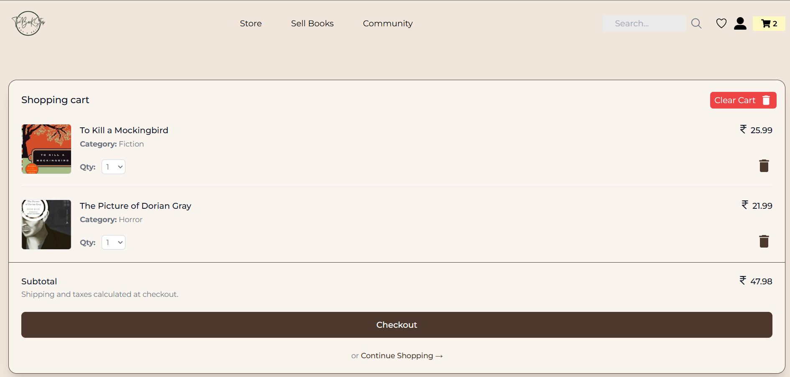

# 📚 TheBookStop  

TheBookStop is a second-hand book buying and selling platform that connects book lovers. Users can buy, sell, and explore books with ease.

---

## 🚀 Features  
- Buy and sell second-hand books  
- User-friendly interface  
- Book recommendations  
- Secure transactions  

---

## 📸 Gallery  

<p align="center">
  <!-- Main Image -->
  
</p>
<p align="center">
  <!-- Two images in a row -->
  
  
</p>
<p align="center">
  <!-- Three images in a row -->
  
  
  
</p>

---

## 🛠️ Tech Stack  
- **Frontend:** React, Vite  
- **Backend:** Node.js, Express  
- **Database:** MongoDB  
- **Styling:** Tailwind CSS  

---

## 📦 Installation  

Clone the repository:  
```bash
git clone https://github.com/yourusername/TheBookStop.git
cd TheBookStop
